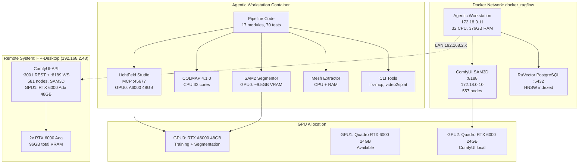

# Performance Statistics — Video-to-USD Pipeline

Measured on the canonical agentic workstation (RTX A6000 48 GB, 32 CPU cores, 376 GB RAM).
Test asset: 15-second video, 15 extracted frames, ~50k Gaussians after 7k training iterations.

## Infrastructure Diagram

## Pipeline Timing Breakdown

| Stage | Duration | Notes |
|-------|----------|-------|
| Frame Extraction (PyAV) | ~5 s | CPU-only, 1 fps default |
| COLMAP Feature Extraction | ~30 s | GPU SIFT on A6000 |
| COLMAP Exhaustive Matching | ~2 min | GPU + CPU |
| COLMAP Sparse Reconstruction | 15-20 min | CPU-bound, all 32 cores |
| COLMAP Image Undistortion | ~10 s | CPU + disk I/O |
| 3DGS Training (7k iterations) | 2 min 15 s | CUDA kernels, 99% GPU util |
| SAM2 Segmentation (13 frames) | ~46 s | Transformer inference |
| Mask Projection to 3D | ~5 s | CPU, per-Gaussian voting |
| Mesh Extraction (Marching Cubes) | ~60 s | CPU + RAM |
| Mesh Cleaning (Trimesh) | ~10 s | CPU |
| USD Assembly | < 1 s | CPU |
| **Total (end-to-end)** | **~22-25 min** | Dominated by COLMAP sparse |

## GPU VRAM Usage per Stage

| Stage | Allocated VRAM | Peak VRAM | GPU Power |
|-------|---------------|-----------|-----------|
| Frame Extraction | 0 MB | 0 MB | idle |
| COLMAP Feature Extraction | ~1.5 GB | ~1.5 GB | 80% util |
| COLMAP Matching | ~1.5 GB | ~1.5 GB | 60% util |
| COLMAP Sparse Recon | ~1.5 GB | ~1.5 GB | CPU-bound (2090% CPU) |
| COLMAP Undistortion | 0 MB | 0 MB | idle |
| 3DGS Training | 8.4 GB | 8.4 GB | 99% util @ 299 W |
| SAM2 Segmentation | 9.5 GB | 9.5 GB | 92% util @ 246 W |
| Mesh Extraction | 0 MB | 0 MB | idle |
| USD Assembly | 0 MB | 0 MB | idle |

**Peak GPU VRAM**: 9.5 GB (SAM2 segmentation stage)

## System RAM Usage per Stage

| Stage | Peak RAM | Notes |
|-------|----------|-------|
| Frame Extraction | ~200 MB | PyAV decoder |
| COLMAP (all phases) | ~4 GB | Feature DB + matching |
| 3DGS Training | ~30 GB | Point cloud + SH coefficients |
| SAM2 Segmentation | ~31 GB | Model weights + frame buffers |
| Mesh Extraction | ~8 GB | Voxel grid + marching cubes |
| USD Assembly | ~100 MB | Scene graph serialization |

**Peak system RAM**: ~31 GB (SAM2 segmentation, co-resident with training data)

## Disk Usage for Intermediate Artifacts

| Artifact | Size | Path |
|----------|------|------|
| Extracted frames (15 frames) | ~45 MB | `<project>/frames/` |
| COLMAP sparse model | ~5 MB | `<project>/colmap/sparse/` |
| COLMAP undistorted images | ~90 MB | `<project>/colmap/undistorted/` |
| 3DGS checkpoint (7k iter) | ~50 MB | `<project>/output/point_cloud/` |
| SAM2 masks (per frame) | ~2 MB | `<project>/masks/` |
| Extracted meshes (per object) | ~10-50 MB | `<project>/meshes/` |
| Final USD scene | ~20-100 MB | `<project>/scene.usda` |
| **Total per project** | **~220-440 MB** | |

## Minimum / Recommended Hardware Specifications

Based on measured peak usage with 20% headroom.

| Component | Minimum | Recommended | Our Setup |
|-----------|---------|-------------|-----------|
| GPU VRAM | 12 GB | 24 GB | 48 GB (A6000) |
| System RAM | 36 GB | 64 GB | 376 GB |
| CPU Cores | 8 | 16 | 32 |
| Disk (SSD) | 50 GB free | 200 GB free | 408 GB free |
| GPU Compute | SM 7.5+ (Turing) | SM 8.6+ (Ampere) | SM 8.6 |
| CUDA | 11.8+ | 12.1+ | 12.4 |

### GPU Compatibility Notes

- **12 GB VRAM**: Can run the pipeline if SAM2 and training do not overlap. Use `CUDA_VISIBLE_DEVICES` to serialize.
- **24 GB VRAM**: Comfortable for single-object scenes. Multi-object with ComfyUI inpainting requires a second GPU or remote endpoint.
- **48 GB+ VRAM**: Full concurrent pipeline including training + segmentation overlap.

### Multi-GPU Configuration

| GPU | Role | VRAM Required |
|-----|------|---------------|
| GPU 0 | Training + SAM2 | 12 GB min, 24 GB recommended |
| GPU 1 | ComfyUI inpainting (local) | 8 GB min |
| GPU 2 (remote) | ComfyUI-API (LAN) | 24 GB+ for FLUX models |
