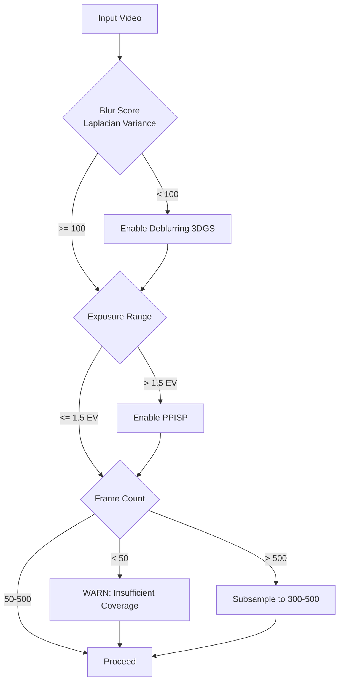
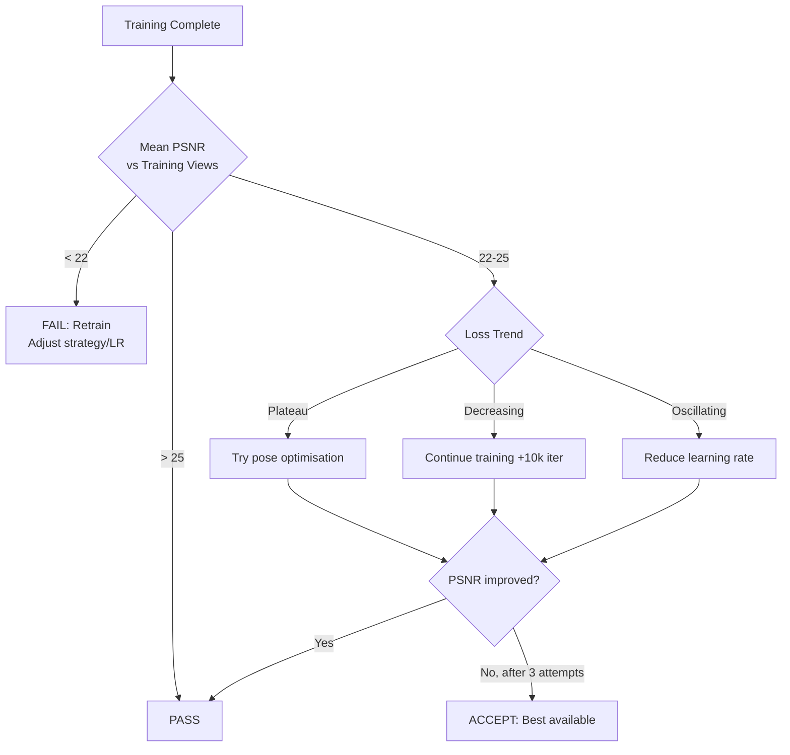
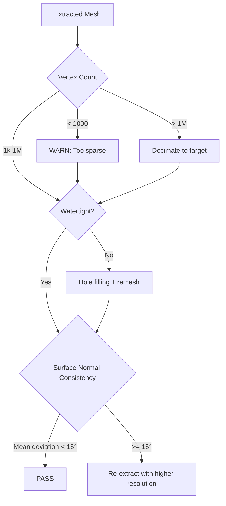

# Agentic Quality Control

## Decision Trees

### Input Quality Assessment



### Training Quality Gate



### Mesh Quality Validation



### Round-Trip Validation

```
Original Gaussians → render views → PSNR_ref
Extracted Mesh → mesh2splat → Gaussians' → render views → PSNR_mesh

Quality Score = PSNR_mesh / PSNR_ref

Score > 0.95: Excellent mesh fidelity
Score 0.85-0.95: Acceptable
Score < 0.85: Re-extract with different method
```

## Metrics

| Metric | Tool | Threshold | Stage |
|--------|------|-----------|-------|
| Laplacian variance | OpenCV | 100 | Input quality |
| Exposure range | Histogram analysis | 1.5 EV | Input quality |
| Training loss | LichtFeld training.get_state | Convergence | Reconstruction |
| PSNR | skimage.metrics | 25 dB | Post-training |
| SSIM | skimage.metrics | 0.85 | Post-training |
| Mesh vertex count | Open3D / trimesh | 1k-1M | Mesh extraction |
| Watertightness | trimesh.is_watertight | True | Mesh extraction |
| Round-trip PSNR | mesh2splat | 0.85x ref | Mesh validation |
| Inpainting coherence | LPIPS | < 0.3 | Background recovery |
