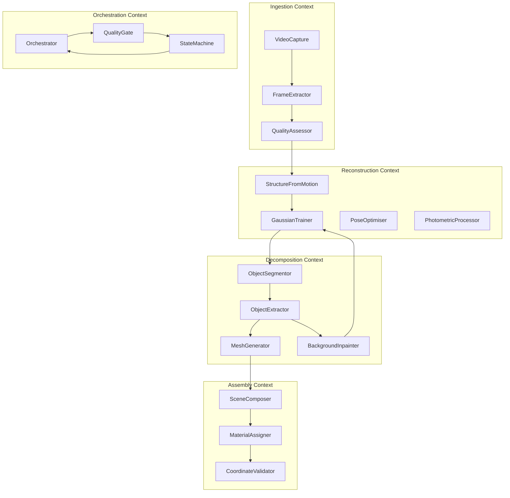
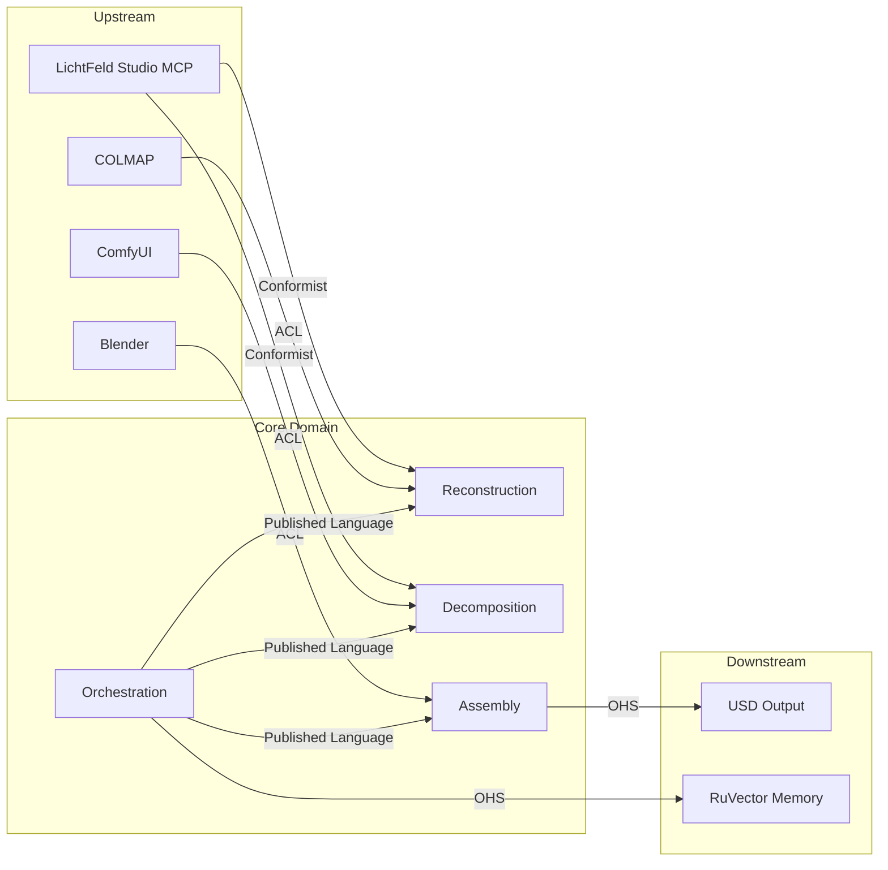

# DDD: Domain Model for Video-to-Scene Pipeline

## Bounded Contexts



## Domain Entities

### Core Entities

#### VideoCapture
```
VideoCapture {
    id: UUID
    source_path: Path
    duration_seconds: float
    resolution: (width, height)
    fps: float
    codec: string
    has_gps_srt: boolean
    created_at: timestamp
}
```

#### FrameSet
```
FrameSet {
    id: UUID
    capture_id: UUID
    frames: [Frame]
    extraction_fps: float
    quality_scores: {blur: float, exposure_range: float, coverage: float}
    total_frames: int
    filtered_frames: int
}
```

#### Frame
```
Frame {
    id: UUID
    index: int
    path: Path
    timestamp_seconds: float
    blur_score: float
    exposure_value: float
    gps_coordinates: optional (lat, lon, alt)
    is_included: boolean
}
```

#### ColmapReconstruction
```
ColmapReconstruction {
    id: UUID
    frameset_id: UUID
    sparse_path: Path
    undistorted_path: Path
    num_cameras: int
    num_points: int
    cameras: [CameraIntrinsics]
    images: [CameraExtrinsics]
    reprojection_error: float
}
```

#### GaussianScene
```
GaussianScene {
    id: UUID
    reconstruction_id: UUID
    checkpoint_path: Path
    num_gaussians: int
    training_iterations: int
    strategy: enum {MCMC, MRNF, IGS_PLUS}
    final_loss: float
    psnr: float
    ssim: float
    has_segmentation_labels: boolean
    objects: [GaussianObject]
}
```

#### GaussianObject
```
GaussianObject {
    id: UUID
    scene_id: UUID
    label_id: int
    name: string  // e.g. "chair_001", auto-named or LLM-named
    num_gaussians: int
    bounding_box: AABB
    centroid: Vec3
    gaussian_path: Path  // exported per-object .ply
    mesh: optional MeshAsset
    confidence: float  // segmentation confidence
}
```

#### MeshAsset
```
MeshAsset {
    id: UUID
    object_id: UUID
    mesh_path: Path  // .obj
    texture_path: Path  // diffuse .png
    material_path: Path  // .mtl
    vertex_count: int
    face_count: int
    has_uv: boolean
    extraction_method: enum {SUGAR, SOF, GOF, TSDF}
    quality_score: float  // round-trip PSNR ratio
}
```

#### BackgroundScene
```
BackgroundScene {
    id: UUID
    scene_id: UUID
    gaussian_path: Path
    mesh_path: optional Path
    inpainted_frames: [Path]
    inpainting_method: string
    retrain_iterations: int
}
```

#### UsdScene
```
UsdScene {
    id: UUID
    scene_id: UUID
    output_path: Path
    objects: [UsdObject]
    background: UsdBackground
    cameras: [UsdCamera]
    metadata: SceneMetadata
    up_axis: enum {Y, Z}
    meters_per_unit: float
}
```

#### UsdObject
```
UsdObject {
    id: UUID
    object_id: UUID
    prim_path: string  // e.g. "/World/Objects/Chair_001"
    gaussian_usd_path: Path
    mesh_usd_path: optional Path
    transform: Transform3D
    material: optional UsdMaterial
    variant_set: {gaussian: bool, mesh: bool}
}
```

### Value Objects

#### Transform3D
```
Transform3D {
    translation: Vec3
    rotation: Quaternion
    scale: Vec3
}
```

#### QualityMetrics
```
QualityMetrics {
    psnr: float
    ssim: float
    lpips: float
    mesh_roundtrip_ratio: float
}
```

#### PipelineState
```
PipelineState {
    current_stage: enum {INGEST, RECONSTRUCT, DECOMPOSE, ASSEMBLE, VALIDATE, DONE, FAILED}
    stage_progress: float  // 0.0 - 1.0
    quality_metrics: QualityMetrics
    retry_count: int
    errors: [string]
    started_at: timestamp
    stage_started_at: timestamp
}
```

## Aggregates

### SceneReconstruction (Root Aggregate)
```
SceneReconstruction {
    id: UUID
    capture: VideoCapture
    frames: FrameSet
    reconstruction: ColmapReconstruction
    scene: GaussianScene
    background: BackgroundScene
    usd_output: UsdScene
    state: PipelineState
    config: PipelineConfig

    // Commands
    ingest(video_path) -> FrameSet
    reconstruct(frameset) -> GaussianScene
    decompose(scene) -> [GaussianObject]
    extract_mesh(object) -> MeshAsset
    inpaint_background(scene, objects) -> BackgroundScene
    assemble_usd(objects, background) -> UsdScene
    validate() -> QualityMetrics

    // Invariants
    scene.psnr >= 25.0  // quality gate
    all objects have mesh OR gaussian representation
    usd coordinate system is Y-up, meters
}
```

## Domain Events

```
VideoIngested { capture_id, frame_count, quality_summary }
ReconstructionStarted { reconstruction_id, strategy, iterations }
TrainingProgress { iteration, loss, num_gaussians }
QualityGatePassed { stage, metrics }
QualityGateFailed { stage, metrics, retry_count }
ObjectDetected { object_id, label_id, name, num_gaussians }
MeshExtracted { object_id, mesh_id, vertex_count, quality_score }
BackgroundRecovered { background_id, inpainted_frames_count }
SceneAssembled { usd_id, object_count, output_path }
PipelineCompleted { scene_id, total_duration, final_metrics }
PipelineFailed { scene_id, stage, error, partial_output_path }
```

## Services

### Orchestration Service
- Manages pipeline state machine
- Dispatches to stage-specific agents
- Handles quality gate decisions
- Manages retries and fallbacks

### MCP Bridge Service
- Wraps LichtFeld MCP HTTP API
- Translates domain commands to JSON-RPC calls
- Handles async operations (training, export)
- Event subscription for progress monitoring

### Segmentation Service
- Gaussian Grouping training integration
- SAGA interactive refinement
- SAM2 preprocessing
- Label-to-object mapping

### Mesh Service
- SuGaR mesh extraction
- SOF/GOF alternative extraction
- TSDF fusion fallback
- Mesh cleaning and decimation
- UV atlas generation
- Texture baking

### Inpainting Service
- ComfyUI workflow management
- Per-view mask generation
- FLUX inpainting execution
- Quality assessment

### USD Service
- Per-object USD export via LichtFeld
- Master scene composition
- Variant set management
- Material assignment
- Coordinate transform application

## Context Map



**Conformist**: We conform to LichtFeld's MCP API as-is.
**ACL (Anti-Corruption Layer)**: We wrap COLMAP, ComfyUI, and Blender CLIs behind domain-specific interfaces.
**OHS (Open Host Service)**: USD output and RuVector memory follow open standards.
**Published Language**: Agent communication uses domain events and the pipeline state model.

## Ubiquitous Language

| Term | Definition |
|------|-----------|
| **Scene** | A complete 3D environment reconstructed from video |
| **Object** | An individually addressable entity within a scene (chair, wall, lamp) |
| **Gaussian** | The 3D Gaussian Splatting representation (splats with position, colour, opacity) |
| **Mesh** | Polygonal surface representation with vertices, faces, UV coordinates, textures |
| **Decomposition** | The process of separating a monolithic scene into individual objects |
| **Inpainting** | Filling holes in images where objects were removed, using AI generation |
| **Quality Gate** | A checkpoint where metrics are evaluated to decide proceed/retry/fail |
| **Round-trip** | Converting Gaussian → Mesh → Gaussian to validate mesh fidelity |
| **Variant Set** | USD mechanism for switching between Gaussian and Mesh representations |
| **Label** | Per-Gaussian integer identifying which object a Gaussian belongs to |
| **Background** | The scene environment after all foreground objects are removed |
