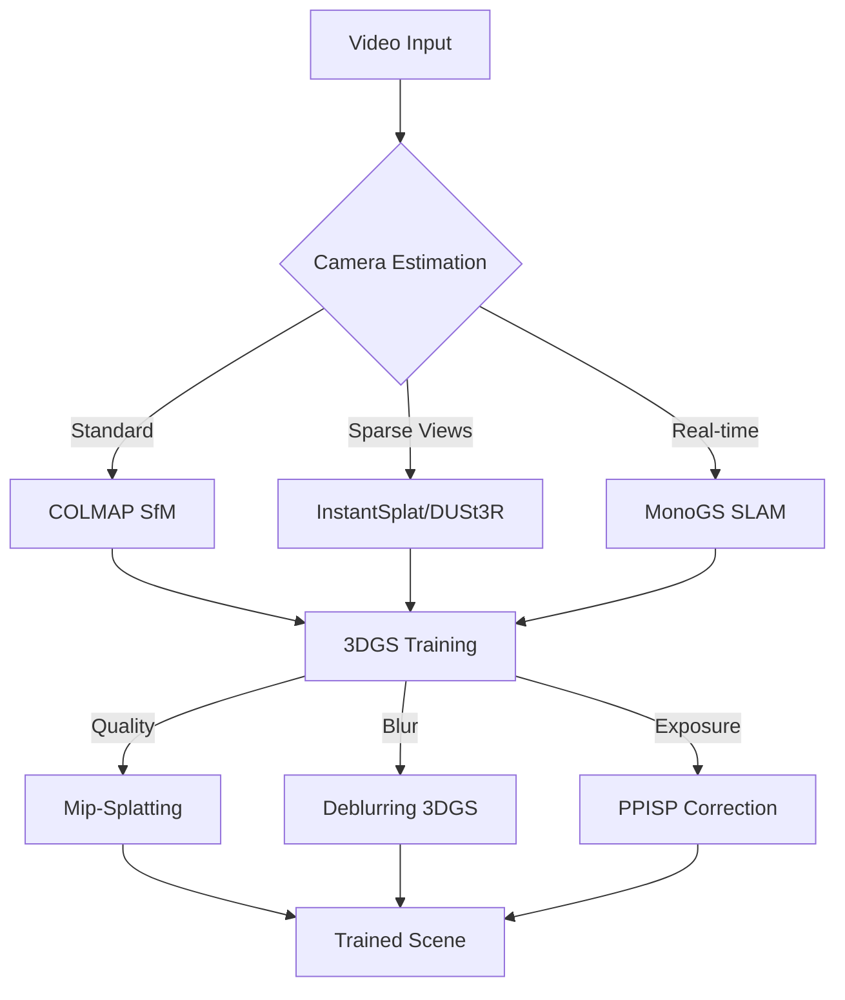
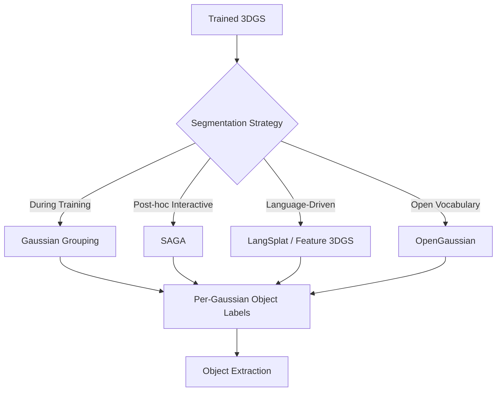
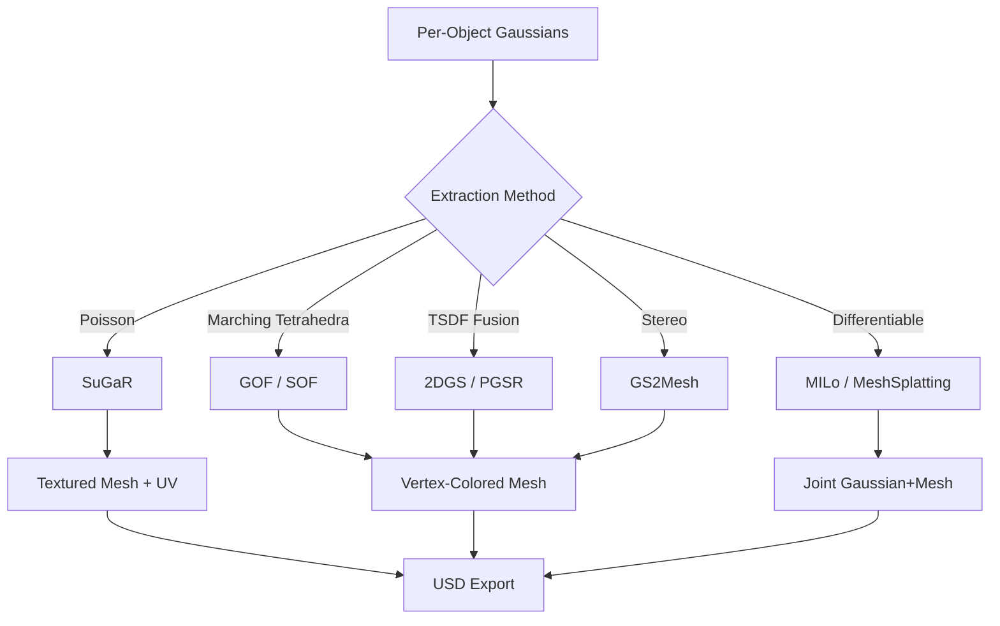
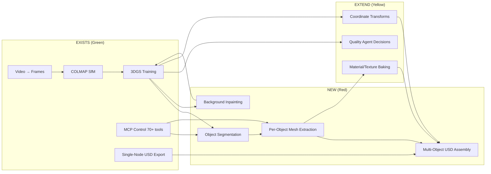

# Field Overview: Video to Structured 3D Scenes (2024-2025)

## Landscape Synthesis

The field of 3D Gaussian Splatting has matured rapidly since the original 3DGS paper (SIGGRAPH 2023). By early 2026, the ecosystem spans reconstruction, segmentation, meshing, editing, and generation — but no single system provides an end-to-end **video → segmented USD scene** pipeline. Our contribution bridges this gap.

## State of the Art by Stage

### Reconstruction

**Maturity**: High. COLMAP + 3DGS is production-proven. LichtFeld Studio wraps the full pipeline with 70+ MCP tools. Quality enhancements (Mip-Splatting, PPISP, deblurring) are incremental improvements.

### Segmentation

**Maturity**: Medium. Multiple approaches exist (ECCV 2024, NeurIPS 2024, CVPR 2024), all with public code. Gaussian Grouping (Apache-2.0, joint training) and SAGA (Apache-2.0, post-hoc) are the most production-ready. The segment-during-training approach produces better boundaries but requires retraining; post-hoc approaches work on any existing model.

**Key Insight**: The field has converged on a common pattern — lift 2D foundation model features (SAM, CLIP) to 3D Gaussians via multi-view consistency. The debate is whether to do this during training (better boundaries, slower) or after (flexible, any model).

### Mesh Extraction

**Maturity**: Medium-High. SuGaR (3.3k stars, CVPR 2024) is the most adopted for textured mesh output. SOF (SIGGRAPH Asia 2025) is the highest quality for geometry. Both are post-hoc (work on any trained model). Differentiable approaches (MILo, MeshSplatting) produce better results but require training integration.

**Key Insight**: Only SuGaR produces UV-mapped textured meshes suitable for standard rendering pipelines. All others produce vertex-colored geometry. For USD with materials, SuGaR is currently the only practical choice for direct output. TSDF fusion + texture baking is the fallback.

### Scene Assembly

**Maturity**: Low. No existing tool composes segmented Gaussian objects into hierarchical USD scenes. LichtFeld Studio exports individual nodes as USD `ParticleField3DGaussianSplat` prims. The composition logic (scene graph, variant sets, material assignment, coordinate transforms) must be built.

**Key Insight**: OpenUSD's Python API (`pxr`) is the right tool. The composition uses `references` to include per-object USD files in a master scene. Variant sets allow dual representation (Gaussian + Mesh) per object.

## Gap Analysis

## Competitive Landscape

| Approach | Maturity | Quality | Speed | Automation |
|----------|----------|---------|-------|------------|
| Our proposed pipeline | New | High (hybrid) | Medium | Full (agentic) |
| Manual in Blender/Maya | Production | Highest | Very Slow | None |
| NeRF2Mesh + SAM | Academic | Medium | Slow | Partial |
| Nerfstudio export | Production | Low-Medium | Fast | Partial |
| Polycam/Luma | Commercial | Medium | Fast | Full (black box) |

Our advantage: **agentic orchestration** with quality decisions at each stage, using LichtFeld's 70+ MCP tools. No existing pipeline provides this level of programmatic control over the reconstruction-segmentation-meshing process.

## Risk Assessment

| Risk | Likelihood | Impact | Mitigation |
|------|-----------|--------|------------|
| Gaussian Grouping quality insufficient | Low | High | Fallback to SAGA + manual refinement |
| SuGaR mesh quality insufficient | Medium | High | Use SOF + texture baking instead |
| Coordinate transforms between stages | High | Medium | Unit tests with known-good datasets |
| ComfyUI inpainting artefacts | Medium | Medium | Multiple inpainting passes, agent quality check |
| VRAM limitations (large scenes) | Medium | High | Per-object processing, streaming approach |
| License incompatibility | Low | High | All critical-path tools are Apache-2.0 or MIT |

## Timeline Estimate

| Phase | Duration | Deliverable |
|-------|----------|-------------|
| Phase 1: Core segmentation | 2-3 weeks | Gaussian Grouping integration |
| Phase 2: Mesh extraction | 1-2 weeks | SuGaR per-object meshing |
| Phase 3: Background recovery | 1-2 weeks | ComfyUI inpainting workflow |
| Phase 4: USD assembly | 1 week | Multi-object scene composition |
| Phase 5: Agentic orchestration | 2 weeks | Full agent-controlled pipeline |
| Phase 6: Quality & polish | 2 weeks | Quality gates, variant sets, materials |
