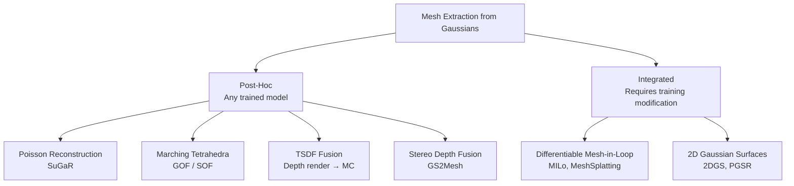

# Gaussian-to-Mesh Extraction Methods

## Taxonomy



## Method Comparison

| Method | Type | Texture | UV Maps | Quality | Speed | Post-hoc | C++ Portable |
|--------|------|---------|---------|---------|-------|----------|--------------|
| **SuGaR** | Poisson | Diffuse | Yes | Good | 30 min | Yes | Yes (libs) |
| **SOF** | March.Tet. | Vertex | No | Excellent | 10 min | Yes | Yes |
| **GOF** | March.Tet. | Vertex | No | Very Good | 20 min | Yes | Yes |
| **TSDF** | Depth fusion | Vertex | No | Good | 5 min | Yes | Yes |
| **GS2Mesh** | Stereo | Vertex | No | Good | 15 min | Yes | Partial |
| **MILo** | Differentiable | Joint | Yes | Excellent | Training | No | No |
| **MeshSplatting** | Direct | Vertex | No | Very Good | Training | No | No |
| **2DGS** | TSDF | Vertex | No | Very Good | Training | No | No |

## Recommended Methods

### Primary: SuGaR (UV-Mapped Textured Meshes)

**Why**: Only method producing OBJ with UV-mapped diffuse textures from Gaussians. Direct compatibility with USD `UsdPreviewSurface` materials and standard rendering pipelines.

**Process**:
1. Surface alignment: regularise Gaussians to lie on surfaces
2. Poisson reconstruction: extract watertight mesh
3. Gaussian binding: re-bind Gaussians to mesh faces
4. UV mapping: auto-parameterise via Nvdiffrast
5. Texture baking: project SH colours onto UV atlas

**Quality**: Good geometry, excellent textures. Tends to over-smooth fine details (trade-off of Poisson reconstruction).

**Output**: `.obj` with `.mtl` and diffuse texture `.png`

### Alternative: SOF/GOF (Best Geometric Accuracy)

**Why**: Highest geometric fidelity via Marching Tetrahedra on opacity fields. SOF is 10x faster than GOF with better detail preservation.

**Process**:
1. Evaluate Gaussian opacity field on adaptive tetrahedral grid
2. Extract isosurface via Marching Tetrahedra
3. Output vertex-coloured mesh

**Quality**: Excellent geometry, especially on unbounded scenes. No UV maps — requires separate texture baking.

**Texture baking** (post-SOF/GOF):
1. Generate UV atlas with xatlas
2. Render Gaussian SH colours from multiple viewpoints
3. Project rendered colours onto UV coordinates
4. Composite into diffuse texture atlas

### Fallback: TSDF Fusion (Simplest)

**Why**: Minimal implementation complexity. Uses existing Gaussian rasteriser.

**Process**:
1. Render depth maps from 32-64 viewpoints using LichtFeld
2. Fuse into TSDF volume (Open3D `ScalableTSDFVolume`)
3. Extract mesh via Marching Cubes
4. Clean: remove disconnected components, smooth, decimate

**Quality**: Lower than SuGaR/SOF but reliable. Good enough for background environment meshes.

## Integration with LichtFeld Studio

### Current State
- **mesh2splat** (EA, BSD-3): Integrated in `src/rendering/mesh2splat.cpp`. Converts mesh → Gaussians.
- **Mesh import**: Assimp loader for OBJ/FBX/glTF/GLB/STL/DAE
- **Mesh processing**: OpenMesh half-edge operations, decimation
- **Scene graph**: `NodeType::SPLAT` and `NodeType::MESH` node types
- **USD export**: `ParticleField3DGaussianSplat` prims (no mesh prims yet)

### Missing
- Splat → Mesh conversion (the inverse of mesh2splat)
- Mesh USD export (`UsdGeomMesh` prims)
- Per-object mesh extraction workflow

### Recommended Integration Path

**Phase 1**: TSDF fallback (use existing depth rendering + Open3D)
**Phase 2**: SuGaR integration (Python, callable from MCP)
**Phase 3**: SOF port to C++/CUDA (native LichtFeld integration)
**Phase 4**: MILo/MeshSplatting-style joint training (long-term)

## Round-Trip Validation

Use EA's mesh2splat to validate mesh quality:

```
Gaussians → SuGaR → Mesh → mesh2splat → Gaussians'
Compare render(Gaussians) vs render(Gaussians')
If PSNR(Gaussians, Gaussians') > 30: mesh is faithful
```

This closed-loop validation confirms the mesh preserves the visual appearance of the original Gaussian representation.
