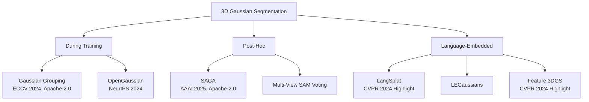

# 3D Gaussian Segmentation Methods

## Taxonomy

## Method Details

### Gaussian Grouping (Recommended Primary)
- **Repo**: https://github.com/lkeab/gaussian-grouping
- **Paper**: ECCV 2024, ETH Zurich
- **License**: Apache-2.0
- **Approach**: Joint training. Each Gaussian gets a compact Identity Encoding. SAM provides 2D supervision. 3D spatial consistency regularisation.
- **Output**: Per-Gaussian integer label → direct object grouping
- **Quality**: Clean boundaries where SAM masks are accurate. Struggles with fine-grained segmentation of similar adjacent objects.
- **Occlusion**: Handles via multi-view consistency voting
- **Export**: Direct per-label Gaussian extraction
- **Integration**: Replace standard 3DGS training. +15 min for SAM preprocessing.

### SAGA (Recommended Secondary)
- **Repo**: https://github.com/Jumpat/SegAnyGAussians
- **Paper**: AAAI 2025
- **License**: Apache-2.0
- **Approach**: Post-hoc. Trains contrastive affinity features on pre-trained 3DGS. Interactive point prompts. 4ms per query.
- **Output**: Binary masks per query, HDBSCAN clustering
- **Quality**: Excellent for targeted selection. Requires user input.
- **Occlusion**: Limited — depends on visible surface from prompt viewpoint
- **Export**: Binary mask → filter Gaussians by mask
- **Integration**: Works on ANY pre-trained 3DGS. No retraining. Best for refinement.

### OpenGaussian
- **Repo**: https://github.com/yanmin-wu/OpenGaussian
- **Paper**: NeurIPS 2024
- **License**: Unspecified
- **Approach**: 6D instance features per Gaussian. Two-stage codebook → CLIP language features. Text-queryable.
- **Output**: Per-Gaussian semantic features, text-driven segmentation
- **Quality**: Good for semantic categories ("all chairs"), less precise for individual instances
- **Integration**: Two-stage training (base 3DGS + feature field). More complex than Gaussian Grouping.

### LangSplat
- **Repo**: https://github.com/minghanqin/LangSplat
- **Paper**: CVPR 2024 Highlight
- **License**: Unspecified
- **Approach**: CLIP language features embedded via scene-wise autoencoder. 512D → 3D compressed features per Gaussian.
- **Output**: Open-vocabulary 3D queries at 199x LERF speed
- **Quality**: Best for natural language scene decomposition. Less precise at pixel level.
- **Integration**: Enables "select all vegetation", "group furniture". Memory-efficient compression.

### Feature 3DGS
- **Repo**: https://github.com/ShijieZhou-UCLA/feature-3dgs
- **Paper**: CVPR 2024 Highlight
- **Approach**: Parallel N-dimensional Gaussian rasteriser. Distils ANY 2D foundation model.
- **Output**: Per-Gaussian features from SAM, CLIP-LSeg, or custom model
- **Quality**: Most flexible. Quality depends on source model.
- **Integration**: Future-proof — swap 2D models without architectural changes. Higher engineering investment.

## Segment-First vs Reconstruct-Then-Segment

| Approach | Evidence | Quality | Speed | Recommendation |
|----------|----------|---------|-------|----------------|
| Reconstruct → Segment | Majority of papers (SAGA, OpenGaussian, Feature 3DGS) | Better 3D consistency | Medium | **Default** |
| Segment → Reconstruct | Pipeline A (inpaint objects, reconstruct separately) | Cleaner per-object geometry | Slow | Fallback |
| Co-training | Gaussian Grouping, MeshSplatting | Best boundaries | Slowest | **Preferred when supported** |

**Our recommendation**: Start with Gaussian Grouping (co-training, best boundaries) as default. Fall back to SAGA (post-hoc) for models already trained without segmentation.

## Production-Safe Licensing

| Method | License | Production Safe |
|--------|---------|----------------|
| Gaussian Grouping | Apache-2.0 | Yes |
| SAGA | Apache-2.0 | Yes |
| OpenGaussian | Unspecified | Risk |
| LangSplat | Unspecified | Risk |
| Feature 3DGS | Unspecified | Risk |
| LEGaussians | Unspecified | Risk |
| GaussianEditor | S-Lab (NC) | No |

**Safe combination**: Gaussian Grouping + SAGA covers both automatic and interactive segmentation with Apache-2.0 licensing.
