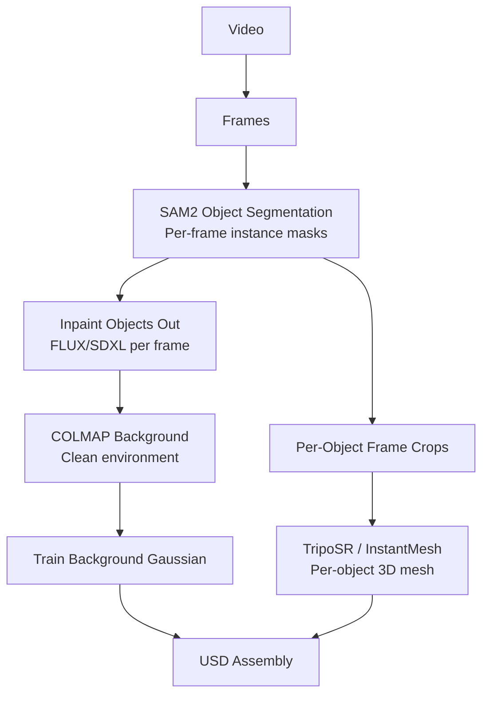
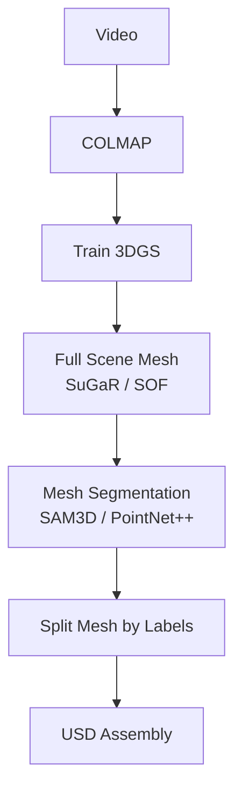
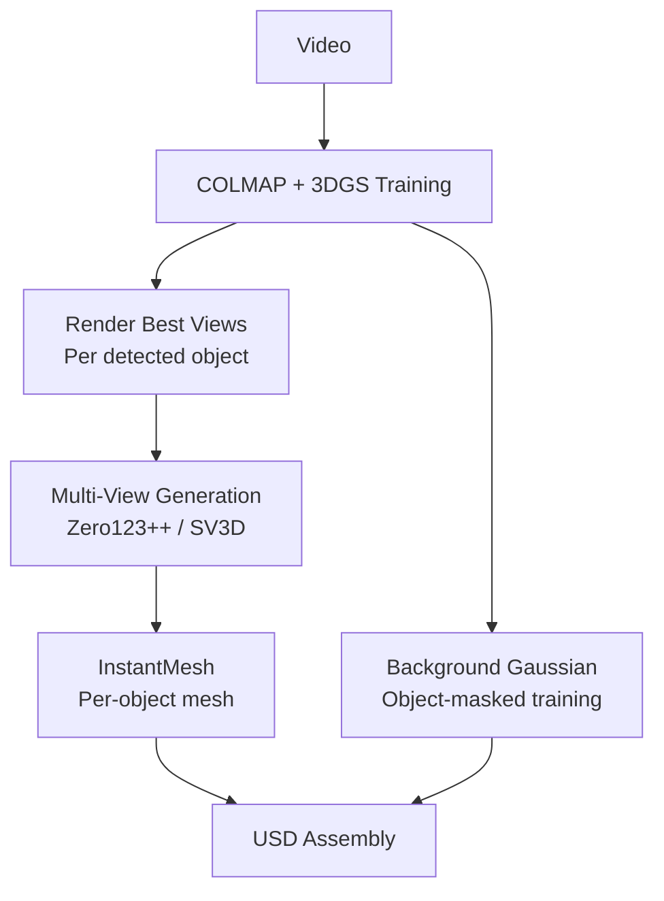
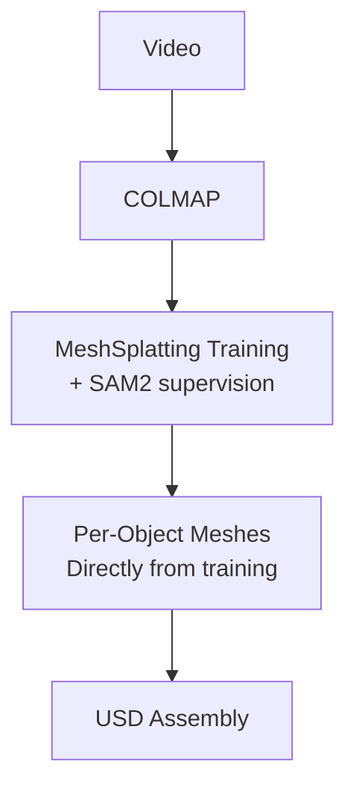
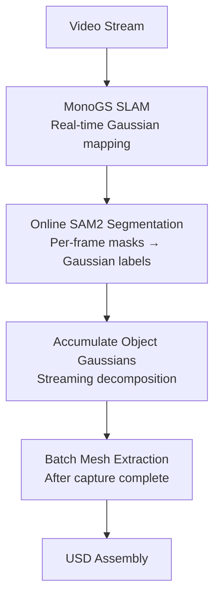

# Alternative Pipeline Approaches

## Pipeline A: Segment-First (Image-Space Decomposition)

**Pros**: Clean separation between environment and objects. No ghosting artefacts.
**Cons**: Inpainting quality is critical. Object poses must be recovered separately (no COLMAP for individual objects). TripoSR quality is lower than SuGaR from multi-view Gaussians.
**Verdict**: Viable but lower quality than reconstruct-then-segment. Good fallback for scenes with very few objects.

## Pipeline B: Full Scene Mesh + Post-Hoc Segmentation

**Pros**: Simplest pipeline. No per-object Gaussian manipulation needed.
**Cons**: Mesh segmentation is harder than Gaussian segmentation (boundaries are less clean). Loss of Gaussian view-dependent appearance. No dual representation (Gaussian + Mesh) per object.
**Verdict**: The hardest path. Polygonal segmentation is a solved problem but results are noisier than Gaussian-space segmentation.

## Pipeline C: Multi-View + Single-Image-to-3D Hybrid

**Pros**: Leverages Gaussian renders as high-quality input for single-image-to-3D. Multi-view generation fills occluded regions.
**Cons**: Quality depends on generated views (hallucination risk). Extra compute for view generation.
**Verdict**: Good for partially occluded objects where direct Gaussian extraction produces incomplete geometry. Complement to main pipeline.

## Pipeline D: Direct MeshSplatting (No Intermediate Gaussians)

**Pros**: Single training step produces segmented meshes directly. No Gaussian-to-mesh conversion needed.
**Cons**: MeshSplatting is newer (2025), less tested. Produces PLY with vertex colours (no UV maps). Requires SAM2 during training.
**Verdict**: Most elegant long-term solution. Monitor MeshSplatting maturity. Currently too new for production pipeline.

## Pipeline E: SLAM-Based Real-Time Decomposition

**Pros**: No offline COLMAP step. Real-time capable. Progressive reconstruction.
**Cons**: SLAM quality < offline SfM. Real-time SAM2 is compute-intensive. No pose refinement.
**Verdict**: Future direction for live capture workflows. Not suitable for production quality.

## Comparison

| Pipeline | Quality | Speed | Automation | Maturity | Our Pick |
|----------|---------|-------|------------|----------|----------|
| **Proposed (Hybrid)** | High | Medium | Full | Medium | **Primary** |
| A: Segment-First | Medium | Fast | Full | High | Fallback |
| B: Mesh Segmentation | Low-Medium | Fast | Full | High | Avoid |
| C: Multi-View Hybrid | Medium-High | Slow | Full | Medium | Supplement |
| D: Direct MeshSplat | High | Fast | Full | Low | Future |
| E: SLAM Real-Time | Low-Medium | Real-time | Full | Low | Future |
