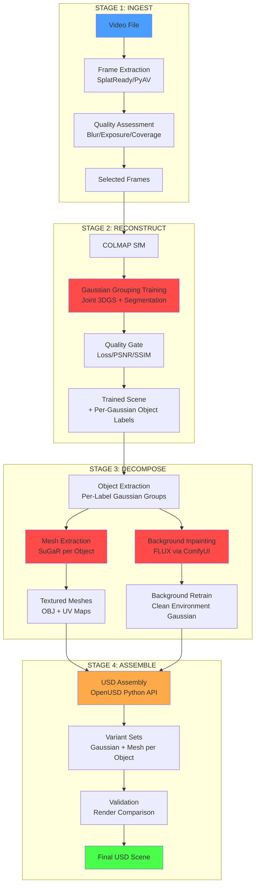
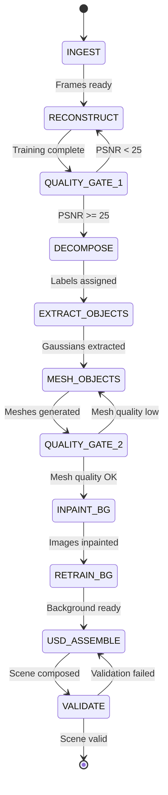

# Proposed Pipeline: Agentic Video-to-Scene

## Architecture Overview



Red = new development, Yellow = extend existing, Blue/Green = input/output.

## Agentic Orchestration



Each state transition is an agent decision point. The orchestrator agent evaluates quality metrics and decides whether to proceed, retry with adjusted parameters, or abort with partial results.

## Stage Detail

### Stage 1: Ingest

**Agent**: Ingest Agent

**Tools**: SplatReady (`extract_frames`), OpenCV (blur detection), LichtFeld MCP

**Process**:
1. Extract frames from video at initial FPS (adaptive: 0.5-2.0 based on motion)
2. Compute per-frame quality: Laplacian variance (blur), histogram spread (exposure)
3. Drop frames below blur threshold
4. Flag sequence for PPISP if exposure variance > 1.5 EV
5. Detect duplicate frames via perceptual hashing
6. Output: quality-filtered frame set

**Decision Points**:
- Frame count < 50 → warn insufficient coverage
- Frame count > 500 → subsample
- All frames blurry → suggest different video or enable deblurring

### Stage 2: Reconstruct

**Agent**: Reconstruction Agent

**Tools**: COLMAP 4.1.0, LichtFeld MCP (70+ tools)

**Process**:
1. Run COLMAP via SplatReady pipeline
2. Load dataset: `lfs-mcp call scene.load_dataset`
3. Train with Gaussian Grouping (joint segmentation):
   - Strategy: MCMC
   - Iterations: 30,000
   - Enable PPISP if flagged
   - Enable pose optimisation if loss > 0.1 at iteration 5000
4. Monitor via `lfs-mcp call training.get_state` every 30s
5. Quality gate: render from training views, compute PSNR/SSIM

**Decision Points**:
- COLMAP fails → fallback to InstantSplat
- Loss plateau before 15k iterations → increase learning rate
- Loss oscillates → decrease learning rate
- PSNR < 25 → retrain with adjusted parameters

**Output**: Trained 3DGS scene with per-Gaussian object identity labels

### Stage 3: Decompose

**Agent**: Decomposition Agent (3 sub-tasks)

#### 3a. Object Extraction

**Tools**: Gaussian Grouping labels, LichtFeld selection tools, SAGA (refinement)

**Process**:
1. Read Gaussian identity labels from training
2. For each unique label > threshold size:
   - Create selection mask
   - `lfs-mcp call history.begin_transaction`
   - Duplicate node for object
   - Store mask for inpainting
3. Optionally refine boundaries with SAGA interactive segmentation
4. Validate: render each object in isolation, check completeness

#### 3b. Mesh Extraction (Per Object)

**Tools**: SuGaR or SOF/GOF

**Primary Path (SuGaR)**:
1. Export per-object Gaussians
2. Run SuGaR: produces OBJ with UV-mapped diffuse texture
3. Clean mesh: remove disconnected components, smooth
4. Decimate to target polygon count

**Alternative Path (SOF + Texture Baking)**:
1. Extract mesh via Marching Tetrahedra on opacity field (vertex-coloured)
2. Generate UV atlas with xatlas
3. Bake diffuse texture from Gaussian colour renders projected onto UV

**Decision**: SuGaR for quality, SOF for speed. Agent benchmarks both on first object, selects winner for remaining objects.

#### 3c. Background Recovery

**Tools**: ComfyUI + FLUX + Gaussian Splats Repair LoRA

**Process**:
1. For each training image:
   - Generate binary mask of all extracted objects
   - Send to ComfyUI FLUX inpainting workflow
   - Denoise strength: 0.65-0.85
2. Replace training images with inpainted versions
3. Retrain background-only Gaussian from inpainted dataset

**Decision Points**:
- Inpainting quality per-view: compare inpainted region texture to surrounding context
- If FLUX LoRA is NC-licensed → use standard SDXL inpainting instead
- Large occluded areas → multiple inpainting passes with varying seeds

### Stage 4: Assemble

**Agent**: USD Assembly Agent

**Tools**: OpenUSD Python API (`pxr`), LichtFeld `scene.export_usd`

**Process**:
1. Export each object as individual USD file via LichtFeld
2. Export background as USD file
3. Compose master scene:
   ```
   /World (Xform, Y-up, meters)
     /World/Environment/Background (ParticleField3DGaussianSplat)
     /World/Objects/Object_001 (Xform + reference to object_001.usd)
       variant_set "representation": gaussian | mesh
     /World/Objects/Object_002 ...
     /World/Cameras/cam_0000 (Camera from COLMAP)
   ```
4. Apply coordinate transforms (COLMAP Y-down → USD Y-up)
5. Create variant sets per object (Gaussian + Mesh representations)
6. Assign materials to mesh variants (UsdPreviewSurface + baked textures)
7. Write metadata: source video, COLMAP params, training config

**Validation**:
- Render USD scene from training viewpoints
- Compare against original training images
- PSNR/SSIM should be within 3dB of original Gaussian render

## Technology Stack

| Stage | Primary | Fallback | Interface | Status |
|-------|---------|----------|-----------|--------|
| Frame extraction | SplatReady (PyAV) | FFmpeg CLI | CLI/MCP | Exists |
| SfM | COLMAP 4.1.0 | InstantSplat/DUSt3R | CLI | Exists |
| 3DGS + Segmentation | Gaussian Grouping | LichtFeld + SAGA | MCP | **New** |
| Pose optimisation | LichtFeld --pose-opt | — | MCP | Exists |
| PPISP correction | LichtFeld native | — | MCP | Exists |
| Object extraction | Label-based selection | SAGA interactive | MCP | **New** |
| Mesh extraction | SuGaR | SOF, TSDF fusion | Python | **New** |
| Background inpaint | FLUX via ComfyUI | SDXL, LaMa | ComfyUI API | **New** |
| Texture baking | SuGaR UV / xatlas | Blender | Python | **New** |
| USD export (single) | LichtFeld export_usd | — | MCP | Exists |
| USD composition | OpenUSD Python | — | Python | **New** |
| Quality assessment | PSNR/SSIM + LLM vision | — | MCP render | Partial |

## Edge Cases and Left-Field Ideas

### Edge Cases
- **Transparent objects** (glass, water): Gaussians handle transparency well but mesh extraction fails. Keep as Gaussian-only in USD.
- **Reflective surfaces**: SH coefficients capture view-dependent reflection. Mesh PBR materials need environment probes.
- **Thin structures** (fences, wires): Gaussians excel but SuGaR over-smooths. SOF's Marching Tetrahedra preserves thin features better.
- **Repeating patterns** (tiled floors, brick walls): COLMAP feature matching may fail. Use InstantSplat fallback.
- **Moving objects in video**: Detect via optical flow residual after camera motion compensation. Mask out for static scene reconstruction, or use 4D Gaussians (future extension).

### Left-Field Ideas
- **DreamGaussian for hole filling**: When an object is partially occluded, generate the unseen portion using DreamGaussian from the best visible view.
- **RL3DEdit for automated cleanup**: Text-driven scene editing ("remove all shadows", "brighten the ceiling") before decomposition.
- **mesh2splat round-trip validation**: Convert extracted mesh back to Gaussians via EA's mesh2splat. Compare render quality. If degradation < threshold, mesh is faithful.
- **Blender procedural materials**: For background elements (walls, floors), detect material type and assign Blender procedural shaders rather than baked textures. Higher quality, resolution-independent.
- **LLM scene understanding**: Before segmentation, render panoramic view and ask LLM to describe the scene. Use description to guide Gaussian Grouping label assignment and naming.
- **ConceptGraphs-style scene graph**: Build semantic relationships between objects ("chair is-on floor", "painting is-on wall") for richer USD metadata.
